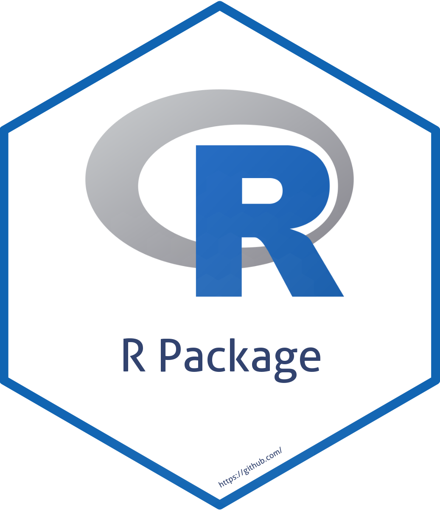

<!-- README.md is generated from README.Rmd. Please edit that file -->


```{r, include = FALSE}
knitr::opts_chunk$set(collapse  = TRUE,
                      comment   = "#>",
                      fig.path  = "man/figures/",
                      out.width = "100%")
```


Practice 6 - Package R 
=========================================================

<!-- badges: start -->
[](https://github.com/rdatatoolbox/practice6/actions/workflows/R-CMD-check.yaml)
[](https://github.com/rdatatoolbox/practice6/actions/workflows/pkgdown.yaml)
[](https://github.com/rdatatoolbox/practice6/actions/workflows/test-coverage.yaml)
[](https://codecov.io/gh/rdatatoolbox/practice6)
[](https://CRAN.R-project.org/package=practice6)
[](https://choosealicense.com/licenses/gpl-2.0/)
<!-- badges: end -->


The goal of the R package `practice6` is to show the structure of an R package. This repository is linked to the practice 6 of the workshop **Data Toolbox for Reproducible Research in Ecology** <https://rdatatoolbox.github.io/ex-package.html>.


## Installation

You can install the development version from [GitHub](https://github.com/) with:

```{r eval = FALSE}
# install.packages("remotes")
remotes::install_github("rdatatoolbox/practice6")
```

Then you can attach the package `practice6`:

```{r eval = FALSE}
library("practice6")
```


## Overview

The only function (dummy function) of `practice6` is `print_msg()`.


## Citation

Please cite this package as: 

> Casajus N (`r format(Sys.Date(), "%Y")`) practice6: An R package to show a good structure of an R package. R package version 0.0.1.


## Code of Conduct

Please note that the `practice6` project is released with a 
[Contributor Code of Conduct](https://contributor-covenant.org/version/2/0/CODE_OF_CONDUCT.html). 
By contributing to this project, you agree to abide by its terms.
